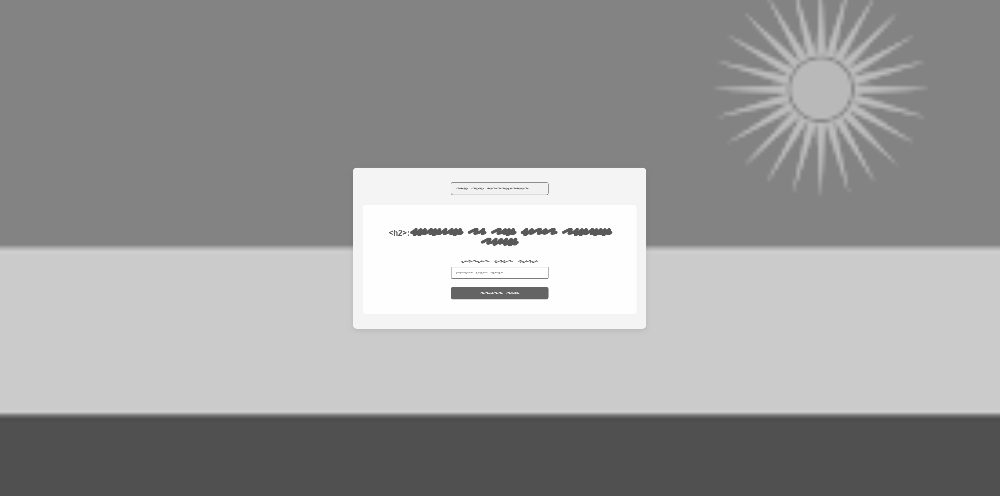
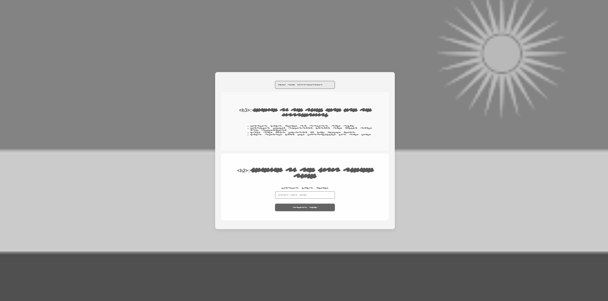
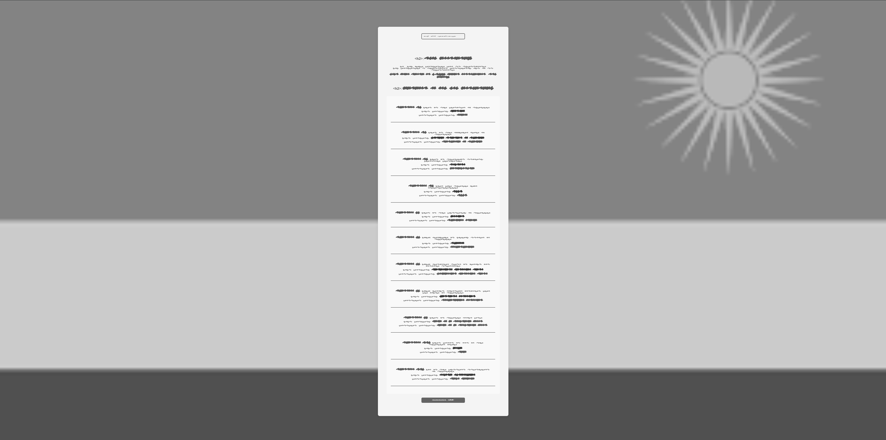
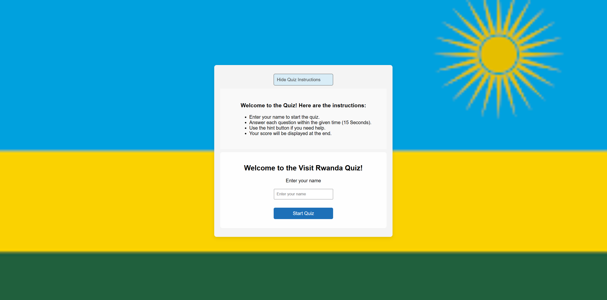
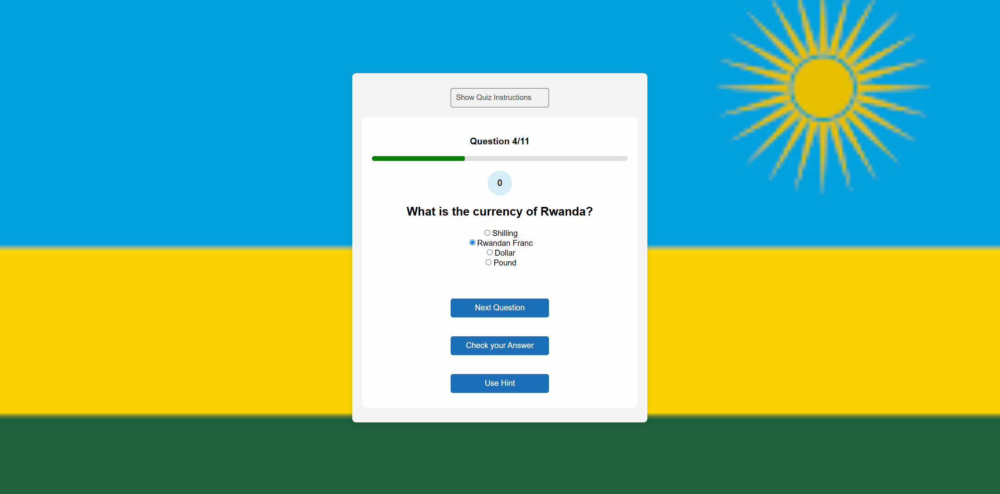
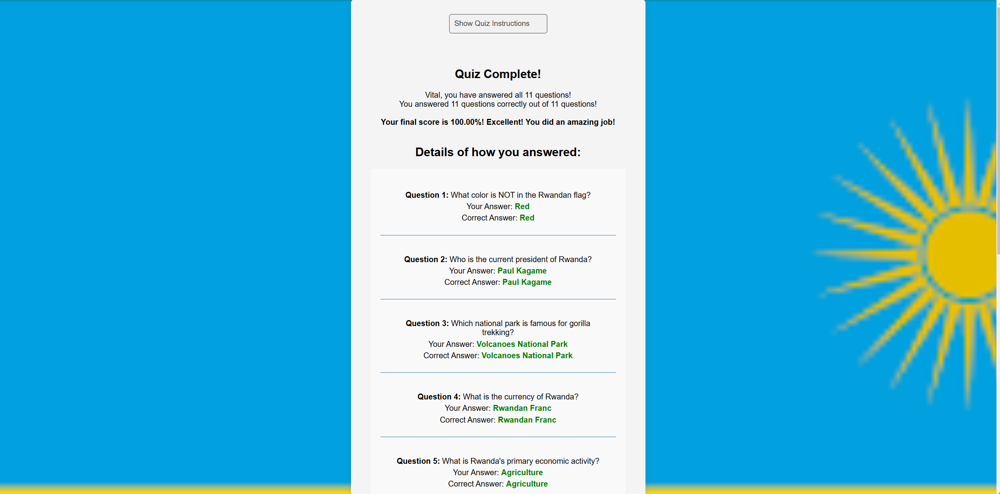
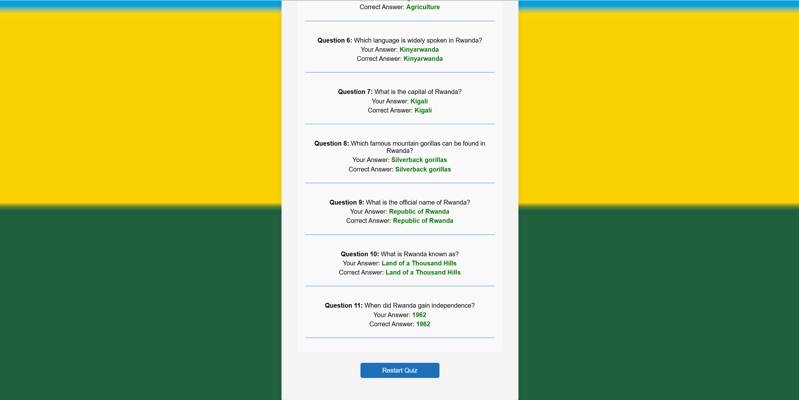
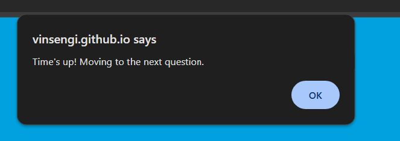
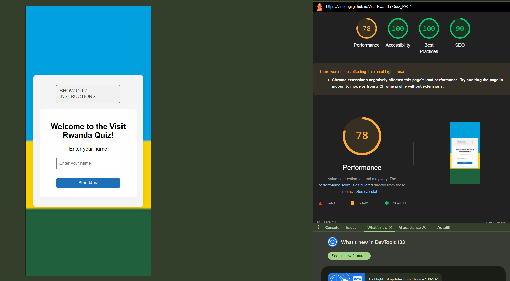
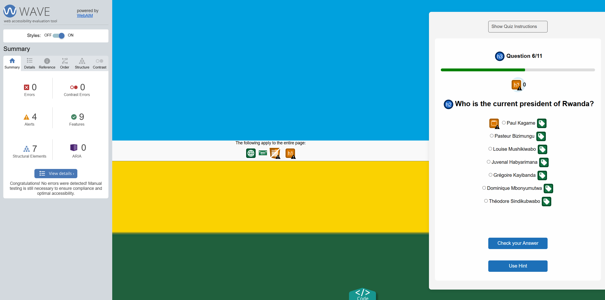

# The Visit Rwanda Quiz

Visit the deployed site: [The Visit Rwanda Quiz](https://vinsengi.github.io/Visit-Rwanda-Quiz_PP2/)

## Description
The Rwandan Quiz Application is a fun and interactive way to test your knowledge about Rwanda. It features 11 questions that cover various aspects of Rwandan culture, geography, history, and more. The application includes user login, a countdown timer for each question, a progress bar, and a scoring system that provides feedback on your answers at the end of the quiz.

## CONTENTS

* [User Experience](#user-experience-ux)
  * [User Stories](#user-stories)

* [Design](#design)
  * [Colour Scheme](#colour-scheme)
  * [Typography](#typography)
  * [Imagery](#imagery)
  * [Wireframes](#wireframes)
  * [Features](#features)
    * [The Home Page](#the-home-page)
    * [The Game Page](#the-game-page)
    * [The High Scores Page](#the-high-scores-page)
    * [The 404 Error Page](#the-404-error-page)
    * [Future Implementations](#future-implementations)
  * [Accessibility](#accessibility)

* [Technologies Used](#technologies-used)
  * [Languages Used](#languages-used)
  * [Frameworks, Libraries & Programs Used](#frameworks-libraries--programs-used)

* [Deployment & Local Development](#deployment--local-development)
  * [Deployment](#deployment)
  * [Local Development](#local-development)
    * [How to Fork](#how-to-fork)
    * [How to Clone](#how-to-clone)

* [Testing](#testing)
  * [Solved Bugs](#solved-bugs)
  * [Known Bugs](#known-bugs)
  
* [Credits](#credits)
  * [Code Used](#code-used)
  * [Content](#content)
  * [Media](#media)
  * [Acknowledgments](#acknowledgments)

- - -

## User Experience (UX)

### User Stories
* I want to take part in a quiz online and improve my general knowledge. I want to be able to play at any time, anywhere.
* I want the site to be responsive to my device.
* I want the site to be easy to navigate.

#### First Time /User or Visitor's Goals
The site’s users want to play an online quiz to test general knowledge about Rwanda as he/she prepares to visit Rwanda.

#### The goal of the site is
To provide a challenging quiz to entertain online users

#### Returning Visitor Goals

* I want to be able to choose a level of difficulty that I feel is appropriate for me, based on my experience from my first visit to the site.

#### Frequent Visitor Goals

* I want to be able to adjust the difficulty level to keep improving my knowledge.
* I want to be able to log my high scores to see how I am performing.

- - -

## Design

### Colour Scheme

As the pages of the site have a background image (Rwandan Flag to help user notice which country), I wanted to keep the colour scheme used on the site quite small so as to not overwhelm users. 

In my css file I have used variables to declare colours, and then used these throughout the css file, i have also used none valiable colors in css.

* I have used  --primary-blue: #1D70B8;
 * I have used --primary-green:green; for the progress bar
 * I have used --accent-yellow: #FAD201;
 * I have used --success-green: #20603D;
 * I have used --error-red: #D62828;
 * I have used --text-dark: #333333;
 * I have used --background-gray: #F4F4F4;
 * I have used --hover-blue: #144a7a;
* I have used  --timer-light-blue: #d9edf7;

* Background Colors: The primary blue is used as the body background, while light gray backgrounds are used for quiz cards and result sections to maintain readability.
* Button and Hover Effects: Buttons use the primary green on hover for interactivity.
* Feedback Colors: Green and red are used to indicate correct and incorrect answers, making it easy for users to see their performance.
* Timer Styling: A soft blue shade is used for the timer to make it easy to read against the quiz card background.
* Progress Bar: Gray and Green is used as an accent for the progress bar, visually representing quiz advancement.
This scheme keeps the quiz interface vibrant, visually consistent, and reflective of Rwanda's national colors. 

### Typography

* For the quiz text, i have used font-family: Arial, sans-serif.

### Imagery

As the website is called The Visit Rwanda Quiz, I used an image of the Rwandan flag as the background image to give the user the feeling that the quiz is really about this land they want to visit.

### Wireframes
#### Login Page Wireframe

#### Login Page with Quiz Instruction uncollapsed

#### Quiz Page

#### Results Page

### Features

- **User Login**: Users can enter their names to personalize the experience.
- **Randomized Questions**: Each quiz session presents questions in a random order.
- **Countdown Timer**: Users have 15 seconds to answer each question.
- **Feedback on Answers (correct/incorrect answers)**: Immediate feedback is provided after each answer is selected.
- **Score tracking system and Score Summary**: At the end of the quiz, users receive a summary of their scores along with comparisons to correct answers.
- **Responsive Design**: The application is designed to work on various devices, including desktops, tablets, and mobile phones.
- **Rwandan Flag Background**: The quiz is visually enhanced with the colors of the Rwandan flag.

#### The Home Page

as soon as you land to the quiz area, you start the quiz just after giving your name in. No navigations involved. You hide or show the quiz instructions if you prefer too. 

#### The Game Page

The quiz page displays the questions (x out of 11). every question has 15 seconds timer which doe NOT force the user to move to the next questions after 15 seconds (Allocated time for answering one question).
Before a choice answer is selected, the "Next" Button is hidden.

#### The Quiz area 
Once the user selects the answer, the "Next" button is shown. once clicked, the user's answer is then recorden as THE CHOICE, and then proceeds to the next question.

If the User would click on "Check your Answwer" Button, the the users would get an instant feedback of whether the selected answer is correct or not correct. Once that is done, the user can may only go to the next question.

#### The Scores Page

#### The alert when time is over

If the user takes more than 15 seconds without selecting an answer, there will come an alert that show that 15 seconds are over and by clicking on "OK", this should automatically move the user to the next question. However, that will be in the next iteration. Currently, the user is not moved to the next question automatically after 15 seconds, reason being that a user should select an answer first before he/she can move forward.

#### The 500 Error Page

No error page was made. to be made in the next iteration.

#### Future Implementations

In future implementations I would like to:

1. Give users the option to select the amount of questions in their quiz.
2. Add some historical information on some questions that could be displayed to the user if the user want it so.
3. Create a back end database to enable me to store scores which would then allow you to see how you scored in previous quizes.
4. Look further into the accessibility for people with colour blindness, perhaps by adding symbols such as a tick or cross next to the answer when they are checked.
5. Force the user to move to the next question when the allocated 15 seconds are over

### Accessibility

I have been mindful during coding to ensure that the website is as accessible friendly as possible. This has been have achieved by:

* Using semantic HTML.
* Using a hover state on all buttons on the site to make it clear to the user if they are hovering over a button.
* Choosing a sans serif font for the site - these fonts are suitable for people with dyslexia.
* Ensuring that there is a sufficient colour contrast throughout the site.

- - -

## Technologies Used
- HTML
- CSS
- JavaScript

### Languages Used

HTML, CSS, Javascript

### Frameworks, Libraries & Programs Used

* [Git](https://git-scm.com/) - For version control.

* [Github](https://github.com/) - To save and store the files for the website.

* [GitPod](https://gitpod.io/) - IDE used to create the site.

* [Google Developer Tools](https://developers.google.com/web/tools) - To troubleshoot and test features, solve issues with responsiveness and styling.

* [TinyPNG](https://tinypng.com/) To compress images

* [Birme](https://www.birme.net/) To resize images and convert to webp format.

* [Am I Responsive?](http://ami.responsivedesign.is/) To show the website image on a range of devices.
- - -

## Deployment & Local Development

### Deployment

The site is deployed using GitHub Pages - [The Visit Rwanda Quiz](https://vinsengi.github.io/Visit-Rwanda-Quiz_PP2/).

To Deploy the site using GitHub Pages:

1. Login (or signup) to Github.
2. Go to the repository for this project, [The Visit Rwanda Quiz](https://vinsengi.github.io/Visit-Rwanda-Quiz_PP2/).
3. Click the settings button.
4. Select pages in the left hand navigation menu.
5. From the source dropdown select main branch and press save.
6. The site has now been deployed, please note that this process may take a few minutes before the site goes live.

### Local Development

#### How to Fork

To fork the repository:

1. Log in (or sign up) to Github.
2. Go to the repository for this project, [The Visit Rwanda Quiz](https://vinsengi.github.io/Visit-Rwanda-Quiz_PP2/)
3. Click the Fork button in the top right corner.

#### How to Clone

To clone the repository:

1. Log in (or sign up) to GitHub.
2. Go to the repository for this project, [The Visit Rwanda Quiz](https://vinsengi.github.io/Visit-Rwanda-Quiz_PP2/)
3. Click on the code button, select whether you would like to clone with HTTPS, SSH or GitHub CLI and copy the link shown.
4. Open the terminal in your code editor and change the current working directory to the location you want to use for the cloned directory.
5. Type 'git clone' into the terminal and then paste the link you copied in step 3. Press enter.

- - -

## Testing
### JavaScipt Validator

### HTML Validator
* Passed

### CSS Validator
* Passed

### Performance testing on mobile devices - with Lighthouse
* Passed

### Accessibility Evaluation
No error shown with the accessibility tool - WAVE.

### Solved Bugs

* several bugs have been fixed during the development.

### Known Bugs

* Radio button of the selectable answers are not adjusted tot he left. it would be possibly be more appealing if they would be aligned left.
* When the 15 seconds are over, no aautomatic action happens. The user should be prompted to  move to the next question.
* Images will be redused using Brime

- - -

## Credits / Acknowledgments

### Code Used

* I used some markdown code provided in the template of README file
* some portions of code were inspired by AI

### Content

All questions for are in accordance with the history of Rwandaa as public domain.

### Media

[Page background image of Rwanda  taken from wikipedia](https://en.wikipedia.org/wiki/File:Flag_of_Rwanda.svg)

### Acknowledgments

I would like to acknowledge the following people:

* Jubril Akolade - My Code Institute Mentor.

* Code Institute Tutors Team - For tipps and their great help.

* The Code Institute Slack channel Peer Code Review - Thank you to everyone who took the time to play the quiz and look over the code.

* Special thanks to online resources and AI for providing quiz-related information.

Otherwise, 
* Inspired by the beauty and culture of Rwanda.
